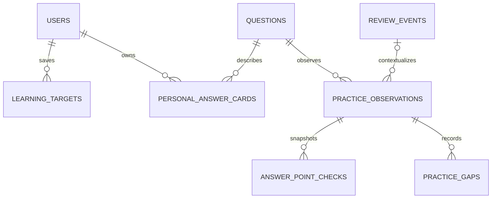

# W0：求职者训练的数据与兼容契约

更新日期：2026-10-09（北京时间）。对应 [开发计划](JOB_SEEKER_DEVELOPMENT_PLAN.md) 的 W0；领域词汇见 [CONTEXT.md](../CONTEXT.md)。

W0 已实现请求校验、范围元数据规则、首期 Schema、增量迁移和独立 PostgreSQL 回归。首页入口、目标保存接口、短轮、个人卡和观察保存接口仍由 W1–W4 实施。现有个人库保持原四表，应用继续使用原有流程。

## 1. 已确定的首期选择

| 事项       | W0 选择与理由                                                                                                    |
| ---------- | ---------------------------------------------------------------------------------------------------------------- |
| 未配置目标 | 沿用通用核心及当前今日推荐，不自动保存目标；首次访问不写任何个人记录                                             |
| 项目范围   | 保留 VendorGuard、发票实习、综合、技术基础；首页不默认进入 VendorGuard                                           |
| 预设       | `general_core` 通用核心、`resume_focus` 简历重点、`project_story` 项目讲述、`foundation_fill` 基础补齐           |
| 预设与项目 | 简历重点包含四种范围；项目讲述包含前三种；基础补齐只包含技术基础；冲突组合返回无效条件，不悄悄扩大范围           |
| 时间档位   | `dailyMinutes=5/10/20/40` 分别建议 `3/5/10/20` 题；这是练习规模偏好，实际队列可更短，不能显示“保证在 N 分钟完成” |
| 面试日期   | 可空的 `YYYY-MM-DD`，校验真实日历日期，允许保留过去日期；按北京时间展示，不转换为 UTC 时间点                     |
| 证据状态   | 个人卡 `evidence` 去除首尾空白后非空时显示“证据已填写”；表示本人填写，不能声称系统核验或证据齐全                 |
| 备份入口   | W7 首先交付 PowerShell / CLI，后续界面复用同一格式；不把设置页作为首期依赖                                       |

这些选择延续计划中“未配置目标沿用通用练习”的规则。W1 可直接据此开发；调整显示默认值不应修改已有队列和个人记录。

## 2. 公共题身份与范围

公共题继续用题干作为 seed upsert 的唯一键，运行时使用稳定数据库 ID。已有题干、标签、答案文本在 W0 未改变；结构化内容与运行时元数据使用同一组类型。

简历题的元数据来源是 `tags` 与 `subcategory`：

- 包含 `简历专项`，且恰好包含一种项目、一种 P0/P1/P2、一种简历实战/基础关联/扩展设计。
- `subcategory` 必须为 `简历专项 · ${project}`。
- 题干中的装饰文字不参与范围识别。导入前校验元数据；错误元数据在写数据库前报错。

`src/lib/learning-contract.ts` 提供常量、`resumeMetadata`、`parseLearningScope`、`scopeForTarget`、`scopeProjects` 与纯函数 `matchesLearningScope`。这些是 W1 的实现入口，当前页面尚未调用新范围解析。

| URL 条件         | 合法值与语义                                                              |
| ---------------- | ------------------------------------------------------------------------- |
| 原条件           | 保留 `category/difficulty/status/search` 的既有语义；关键词仍只搜索题干   |
| `preset`         | 四种预设；省略表示普通题库，不自动限定为核心新题                          |
| `track`          | `resume`；项目、简历优先级、回答性质或简历预设自动补充此条件              |
| `project`        | 单个 VendorGuard / 发票实习 / 综合 / 技术基础，未指定时按预设决定项目集合 |
| `resumePriority` | P0 / P1 / P2；独立于 easy / medium / hard                                 |
| `resumeKind`     | 简历实战 / 基础关联 / 扩展设计                                            |

所有条件以 AND 组合，预设的项目集合内部以 OR 组合。通用核心预设不增加简历限制，其范围统计覆盖所有启用题；推荐中的核心新题和既有核心进度仍只来自 30 题路径。空值视为未指定，非法值、重复参数数组和冲突组合报错；W1 页面展示可修正提示，API 返回 400。旧 URL 未携带新字段时维持原行为。

W1 只扩展现有 `questions.ts` 条件构造入口，列表、范围题数、统计、候选查询复用它；不能分别实现标题匹配和标签匹配。`matchesLearningScope` 是契约测试的内存判定基准，数据库条件需与其逐题一致。

2026-10-09 内容基线：全部 670、简历 100、项目讲述 78、基础补齐 22；四范围为 60/13/5/22，优先级为 63/32/5。这些数字只用于当前内容回归，不硬编码进页面或选题逻辑。

## 3. 首期实体与约束

实际字段以 [schema.ts](../src/db/schema.ts) 为准；以下记录接口语义和跨表约束。用户身份由服务端取得，当前仍为 `default`，请求不接受 `userId`。

| 表                      | 字段与约束                                                                                                                                                                                                                                    |
| ----------------------- | --------------------------------------------------------------------------------------------------------------------------------------------------------------------------------------------------------------------------------------------- |
| `learning_targets`      | UUID `id/request_id`；`user_id` 外键；`preset`；可空 `project_scope/priority/interview_date`；`daily_minutes`；`active`；创建与更新时间。`(user_id,request_id)` 唯一，`active=true` 时 `user_id` 唯一；枚举、时间档位和预设冲突有数据库 CHECK |
| `personal_answer_cards` | `(user_id,question_id)` 主键及外键；可空 `short_answer/example/contribution_boundary/evidence`；`revision` 初始 1、必须为正数；`updated_at`。每个文本最多 10,000 字符，空白由服务端转为 null                                                  |
| `practice_observations` | UUID `id/request_id`；`user_id/question_id` 外键；可空 `review_event_id`；不可被后续卡点修改重写的规范化 `payload`；`created_at`。`(user_id,request_id)` 唯一；事件关联使用 `(event_id,user_id,question_id)` 复合外键                         |
| `answer_point_checks`   | `id`；`observation_id/user_id/question_id`；`position` 0–2；`point_text_snapshot` 非空且最多 2,000 字符；`covered`；可空 `note` 最多 2,000 字符；`created_at`。同观察内 position 唯一，复合外键保证所属用户和题目与观察相同                   |
| `practice_gaps`         | `id`；`observation_id/user_id/question_id`；`kind`；可空 `note/resolved_at`；`created_at`。同观察同 kind 唯一；kind 为 concept/expression/evidence/follow_up/other；note 最多 2,000 字符；复合外键关联观察                                    |
| `app_schema_migrations` | 技术表，`version` 主键、`checksum`、`applied_at`；仅用于迁移版本与文件一致性                                                                                                                                                                  |

所有新增外键使用 restrict，禁止删除仍被个人资料引用的题目、用户或历史事件。题目停用不删除个人卡与观察。普通完成的 attemptId 唯一索引、事务、进度行锁与正式完成语义保持原样；`review_events` 仅增加 `(id,user_id,question_id)` 唯一约束作为事件归属外键的目标。

与原建议相比增加了 `practice_observations`：一次请求可同时保存三个要点和多个卡点，需要共同的请求身份与事务边界。`review_event_id` 放在观察父记录中，子记录通过观察读取，避免各自关联不同历史作答。增加的卡片 revision 用于避免多标签页覆盖，request_id 用于重复请求安全处理。



## 4. 接口与并发契约（由 W1 / W3 实现）

请求通过 `learning-contract.ts` 的 strict Zod schema 校验，拒绝额外字段；正文非法返回 400。日期使用字符串，JSON 的 ID 使用数字或 UUID，不接收数字字符串。

### 目标保存

`GET /api/learning-target` 返回 `{ target: null }` 或当前目标。`PUT /api/learning-target` 接收：

```json
{
  "requestId": "0a9b2d90-529d-4dbd-94b8-f8f7e0a84026",
  "preset": "resume_focus",
  "projectScope": "VendorGuard",
  "priority": "P0",
  "dailyMinutes": 10,
  "interviewDate": null
}
```

服务端先锁定用户行，在事务内检查 requestId，再将旧目标设为 inactive 并插入新目标。相同 ID、相同规范化配置返回原记录 200，相同 ID 不同配置返回 409，新记录 201；多个不同请求按锁顺序切换目标。不能因为旧请求重试而重新激活旧目标。旧目标的筛选配置不可原地改写；旧目标仅更新 active 和 updated_at。

目标保存只写目标表。目标配置是后续轮次偏好，已有 URL queue、历史记录和个人卡不重算。

### 个人回答卡

`GET /api/answer-cards?questionId=...` 返回 `{ card: null }` 或个人卡。`PUT /api/answer-cards` 接收 `questionId/expectedRevision` 和四个可空白字符串；未传的文本默认空白。这是完整替换，局部修改需客户端带上原有字段。

新卡使用 expectedRevision=0，创建后 revision=1；更新必须匹配当前 revision，再加 1。重试时若期望版本落后一次、当前卡四字段与规范化请求相同，可返回当前记录 200；其他版本冲突返回 409 并提供刷新后合并入口。修改卡片不修改 `review_events.answer`、次数或复习安排。数据库唯一键与 revision 约束只提供基础保护，原子条件更新和重试分支由 W3 实现。

### 作答观察

`POST /api/practice-observations` 接收 requestId、questionId、可空 reviewEventId、pointChecks、gaps。三个要点允许部分填写；position 为 0/1/2，保留当时展示的要点原文。每种卡点一条，重复类型拒绝；同次可有五种不同卡点。两数组不能同时为空。

服务端验证题目存在；如带事件 ID，必须属于当前用户和该题，且 `kind=practice`。复合外键保证归属，practice 类型仍需服务端检查。观察可独立保存或在正式完成后关联事件；若完成请求失败，先保留观察草稿，完成恢复后再保存观察，不伪造完成记录。

规范化时去掉文本首尾空白，按 position 和固定 kind 顺序排列数组，并将默认空值补齐；存入父记录 payload。事务内插入父记录与所有子记录，同 ID 相同 payload 重试返回原记录 200，不同 payload 返回 409，新建 201。解决卡点只修改 resolved_at，不改父 payload，因此原请求在解决卡点后重试也不重新打开卡点。父 payload 不用于自动判断能力。

`GET /api/practice-gaps` 复用范围、kind、未解决状态筛选。后续 `PATCH /api/practice-gaps/:id` 以明确的 resolved 布尔值解决 / 重开，重复操作保持首次状态变更时间；不能使用 toggle。所有请求只访问当前用户的数据。不存在返回 404，暂时失败返回 500 并保留草稿；这些新接口不修改现有 POST /api/attempts。

## 5. 队列与统计口径

W1 统一扩展 roundSize、设置、首页链接与总结为 3/5/10/20。已有带 queue 的 URL 优先恢复旧队列；目标、掌握状态、日期或午夜跨日都不能覆盖它。停用题按当前跳过规则处理。W0 只提供档位契约，当前页面仍为 10/20 题。

目标推荐在当前范围内按到期 → 正式练过的薄弱题 → 未正式练过的路径题补齐，先排除北京时间当天已正式完成的题并按 ID 去重。前两类沿用原有到期排序与最新正式完成时间排序；简历路径新题按 P0/P1/P2、项目固定顺序 VendorGuard/发票实习/综合/技术基础、题目 ID 升序。通用核心的新题仍使用原 30 题路径，普通 640 题不会自动成为通用新题。

范围外到期题显示数量与独立入口，不占目标短轮；该提示表示明确到期的启用题，包含当天已练过但手工调整到期的题，因此不等同于可自动推荐数量。手动重练可绕过当天排除。每道队列项保留 due/weak/core/path 来源，显示真实数量，不以目标题数假充实际题数。

| 指标       | 分子、分母与边界                                                                                              |
| ---------- | ------------------------------------------------------------------------------------------------------------- |
| 范围题数   | 当前启用题集合 S 的大小；所有范围条件一致                                                                     |
| 正式覆盖   | 当前用户在 S 内至少有一次 practice 事件的独立题数 C；比例 C / \|S\|，空范围返回 null 并显示“当前范围没有题目” |
| 未练题     | S 减去已正式覆盖题；legacy、查看答案和修改掌握状态都不算正式练过                                              |
| 自评分布   | S 内最新进度行的 mastered/fuzzy/unknown 与无进度行的 unmarked；明确标为本人自评，不能当正式覆盖               |
| 个人卡数量 | S 内有卡记录的独立题数；即使四字段全空也属于已建立卡片                                                        |
| 证据已填写 | S 内 evidence.trim() 非空的卡片数；本人填写状态                                                               |
| 卡点计数   | 当前用户、S 内未解决卡点的记录数，按 kind 分组；同题多次卡点可重复计数，补练队列按题目 ID 去重                |
| 卡点补练   | 未解决记录按最早 created_at、id 排序，再按题目 ID 去重；固定队列仍用现有 session，不复制公共题                |

范围统计只读，切换目标后分母自然改变，不删除范围外资料。覆盖查询使用 EXISTS / DISTINCT 防止卡片、要点和卡点联表膨胀正式事件数；统计不命名为“面试通过率”。

## 6. 迁移、备份与回退

增量 SQL 是 [0001_job_seeker_foundation.sql](../src/db/migrations/0001_job_seeker_foundation.sql)，从 bb1996d 的四表 Schema 生成，只建五张业务表、一张迁移表和必要约束 / 索引，不更新四表记录、不导入题目、不创建目标。唯一约束先于相关外键执行。

迁移函数 `migrateLearningFoundation(client)` 由调用方提供连接，模块导入不连接数据库。CLI 默认只显示说明，不连接、不修改；`--apply` 才执行。一个 PostgreSQL 事务包含 advisory lock、基线检查、全部 DDL 和版本记录，失败整体回滚。重复执行同版本同 SHA-256 跳过，文件变动拒绝；checksum 统一 CRLF/LF。已应用文件冻结，后续修改用新版本。

旧库在启用 W1 前按以下顺序升级：

1. 核对实际数据库地址与库名，停应用写入并制作包含 Schema、序列、四表数据的恢复备份。将备份在独立库恢复，确认原题 ID、用户、进度与事件。
2. 对已恢复的副本执行本迁移，比较迁移前后的四表全部记录；验证新版应用原有提交、幂等和续练契约，再保留副本验收结果。
3. 执行 `pnpm db:migrate:w0 --apply`（wrapper 不可用时使用下面的 Node 命令）。核对迁移记录、约束、新表为空、四表记录一致；再启用 W1 页面和接口。
4. 不需要因 Schema 迁移而运行 seed。以后 seed 只更新公共题和默认用户，不触碰个人表。

```powershell
# 默认只查看说明，不连接数据库
node --import tsx src/db/migrate-learning-foundation-cli.ts
# 仅在备份、恢复演练与连接核对完成后升级旧库
node --import tsx src/db/migrate-learning-foundation-cli.ts --apply
```

空新库继续通过 `db:push` 建当前完整 Schema，不执行要求四表基线的 W0 增量迁移；这种新库没有 W0 应用记录。已存在新表但没有迁移记录的库，runner 拒绝自动接管，按建库来源核对；不能用 `db:push` 代替旧库的受控升级。后续迁移需支持这两种已知初始化方式。

迁移失败由事务自动回滚。迁移成功但应用需回退时，先回退页面 / API，新增表可保留，旧代码兼容；已有新个人资料时不得删表。确需数据库回退时恢复完整备份到另一库、核对后切换连接，并先导出迁移后新增资料。W0 不提供一键删表回退命令。

W7 统一备份包至少含版本、北京时间导出时间、迁移清单、十张表与序列；可以使用 PostgreSQL 原生备份作为可恢复本体，另附 JSON / Markdown 可读导出。禁止把数据库密码写入清单。浏览器未完成草稿不属于服务端备份，必须单独标明；本批次尚未开发备份工具。

## 7. 第二期实体边界

W0 不提前建第二期表，以下是 W5 / W6 设计入口，不是已实现字段。

- `mock_sessions`：UUID id、user_id、可空 target_id、project_scope、状态 active/completed/abandoned、当前节点顺序、开始 / 结束时间。当前节点改变只写模拟轮，不写普通事件。
- `mock_session_nodes`：UUID id、mock_session_id、非负 position、kind main/follow_up/foundation、可空 question_id、问题与参考要点快照、可空回答、pending/answered/skipped 状态、更新时间；(session_id,position) 唯一。跳过后重开保留原快照与排序；重试使用独立请求身份。
- `interview_reviews`：UUID id、user_id、面试日期、岗位 / 面试名称、可空备注、创建 / 更新时间。
- `interview_review_questions`：UUID id、review_id、position、原问题快照、可空 question_id、回答摘要、卡点与改进、可空来源记录；(review_id,position) 唯一。公共题关联可后补，原问题文本始终保留。

第二期外键采用 restrict，并校验父记录归属；模拟节点和复盘关联不能生成 practice 事件。需要普通补练时由用户主动打开现有 session，真正完成才调用 attempts。W5 / W6 实施时再确定模拟回答更新版本和复盘编辑接口，不把当前草稿协议复制为长期个人存储。

## 8. 验证与下一批次入口

2026-10-09（北京时间）：新增 7 项契约单元测试通过；新增 5 项独立 PostgreSQL 集成测试通过，覆盖旧四表迁移、并发 / 重复执行、失败回滚、checksum 冲突、唯一当前目标、复合归属、历史快照与 seed 保留个人数据。新库通过现有测试 helper 从当前 Schema 建库后，原 16 项数据库契约回归也通过。完整单元、静态和生产构建结果见 [项目状态](../PROJECT_CONTEXT.md) 的本次验证记录。

新库回归曾暴露复合外键先于唯一索引执行的问题，已将两处关联身份改为表级 UNIQUE；增量迁移也保证唯一约束先于引用它的外键。原 attemptId 唯一索引保持原名和语义。

本批次页面和 API 路由没有新增，个人数据库未迁移、未写验收记录；生产服务已用 W0 新构建重启，七个原有入口 HTTP 200，重启前后个人库快照相同。没有重跑浏览器交互或视觉检查。W1 接手先读本文、PROJECT_CONTEXT.md、learning-contract.ts 和 schema.ts，再将共享条件接入页面与候选查询，实施目标事务接口和 3/5 题流程；不要把本批次请求 schema 当成已经上线的接口。
